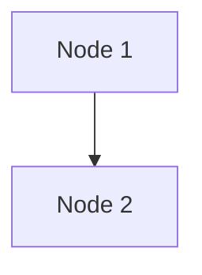

To include a Mermaid diagram in an Atomic Learning `content.md` file, you should use standard Mermaid syntax within Markdown. For instance, the following code:

````markdown

````

will render as 


# Accessibility

You should specify the `accTitle` and `accDescr` values within the Mermaid diagram for accessibility. The description in `accDescr` will often describe the exact relationships in the diagram but, at least, it should convey the main purpose and important points of the diagram.
